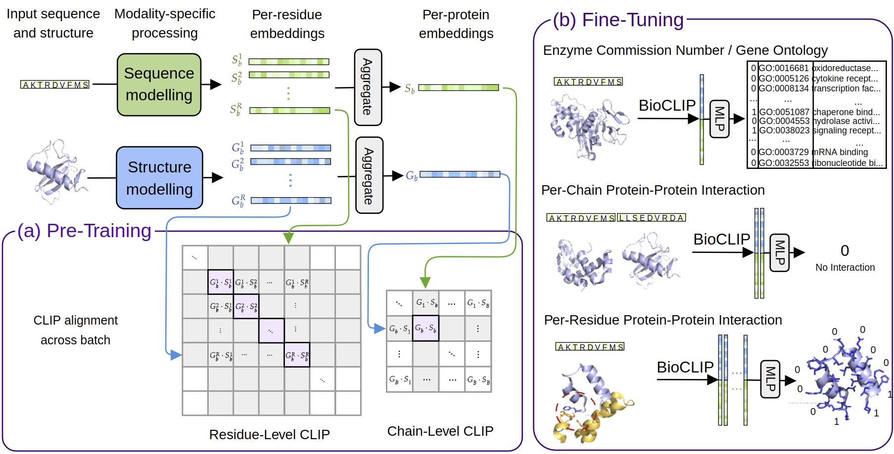

# BioCLIP

[](https://www.biorxiv.org/content/10.1101/2023.12.01.569611v1)
[](LICENSE)




*Fig. 1: Pre-training, fine-tuning and downstream task illustrations. The modules in light blue are tuned, the modules in green are fixed.*

This repository associated with the [BioCLIP paper](https://openreview.net/forum?id=fhCSDMkrFr).

## Description
BioCLIP addresses the challenges of training protein structure encoders, to provide good representations which are complementary to protein sequences encoders. BioCLIP consists of distilling representations from a protein sequence encoder, in this case ESM2 ([esm2_t30_150M_UR50D](https://github.com/facebookresearch/esm#available-models), this is configurable), into a structure encoder. This is done with contrastive learning, with the batch level sampling able to balance the number of similar sequences and distinct sequences, forcing some similar sequences in the batch makes it more challenging to determine the negatives in the CLIP loss. There is also a residue level CLIP loss, which samples a residues from the whole batch and tries to match the residue and the chain. This pretraining method is used on three types of downstream task: protein-protein interaction, Gene Ontology annotation and Enzyme Commission number prediction, and finally per-residue protein-protein interaction.

## Environment
Make sure you have docker and git installed.

```bash
git clone https://github.com/instadeepai/bioclip
cd bio-clip
```

Build according to the machine type, the code is best optimised to run on a TPU. This command automatically detects whether you are on a CPU/GPU/TPU machine and builds accordingly. 
```bash
make dock
```

## Checkpoint

The checkpoint corresponds to the pretrained checkpoint in the [BioCLIP paper](https://openreview.net/forum?id=fhCSDMkrFr).

The checkpoint is 187MB. Make sure you're in the `bio-clip` directory when running this:

```bash
git clone https://huggingface.co/InstaDeepAI/BioCLIP
```


## Data

Pre-training and all downstream have a sample of data provided to allow the user to verify that everything is working. The pretraining data was too large to host, but we provide scripts to regenerate it. These can be found in: `datasets/pretraining/create`. Similarly, for GO term, EC numbers and ResiduePPI tasks the data was too large to host, so the data preprocessing scripts are provided in `datasets/downstream/go_ec/create` and `datasets/downstream/per_residue_ppi/create`. The PPI task will perform the preprocessing on the fly if the data is not provided.

```
Pre-Training:
   ~20 GB | samples/ <------------------------- [Needs to be generated]
   145 MB | train_set.fasta
     8 MB | cluster_sizes.json
     3 MB | prefiltered_val_set_unif.fasta
     2 MB | prefiltered_val_set_clust.fasta
     8 MB | clusterRes_cluster.tsv

PPI:
     1 MB | cerevisiae_array.npy
     7 MB | human_array.npy
   1.4 GB | h5_ppi_processed.h5  (Generated on the fly)

GOEC:
  11.4 GB | go_ec.h5 <------------------------- [Needs to be generated]
   116 MB | go_ec_deepfri_baseline.npy

Residue-PPI:
   110 GB | contacts_rr5A_64nn_8192_wat.h5 <--- [Needs to be generated]
     3 MB | subunits_train_set.txt
     1 MB | subunits_test_set.txt
     1 MB | subunits_validation_set.txt
    52 KB | masif_benchmark_ppi.json
```


## Pre-Train

This will run on a subset of the pre-training dataset, note: this overrides the default batchsize to be smaller.
```bash
python /app/bio-clip/scripts/pretrain/train_bioclip_distributed.py training.batch_size=2 training.chunk_size=2 training.batch_size_gnn_per_device=2 training.batch_size_esm_per_device=2
```

## Fine-Tune

To fine-tune on all tasks, for all experiments:
```bash
python /app/bio-clip/scripts/fine_tuning_launcher.py
```

To run on a specific downstream task there are three scripts:
```
scripts/
├── finetune
│   ├── go_terms.py
│   ├── ppi.py
│   └── residue_ppi.py
├── ...
```

The following arguments are consistent between the three scripts and are used to determine the experiment type. The full BioCLIP model is "Tuned ESM, tuned BioCLIP GNN".

| Experiment Name               | use_gnn_embedding | first_trainable_gnn_layer | load_bioclip_params | use_esm_embedding | train_esm_from |
|-------------------------------|-------------------|---------------------------|---------------------|-------------------|----------------|
| Random GNN                    | True              | 0                         | False               | False             | 100            |
| Tuned ESM                     | False             | 100                       | False               | True              | -3             |
| BioCLIP GNN                   | True              | 0                         | True                | False             | 100            |
| Tuned ESM, tuned BioCLIP GNN  | True              | 0                         | True                | True              | -3             |
| Probe BioCLIP GNN             | True              | 100                       | True                | False             | 100            |
| Probe Random GNN              | True              | 100                       | False               | False             | 100            |
| Probe ESM, BioCLIP GNN        | True              | 100                       | True                | True              | 100            |


For example, if you want to run the random GNN baseline on the EC number task:
```bash
python /app/bio-clip/scripts/finetune/go_terms.py training.data.ontology=ec training.use_gnn_embedding=True training.first_trainable_gnn_layer=0 training.load_bioclip_params=False training.use_esm_embedding=False training.train_esm_from=100 training.tune_esm=True training.checkpoints.checkpoint_dir=BioCLIP/checkpoint experiment_name=Random_GNN
```
If you want to run the full BioCLIP model on the residue PPI task:
```bash
python /app/bio-clip/scripts/finetune/residue_ppi.py training.use_gnn_embedding=True training.first_trainable_gnn_layer=0 training.load_bioclip_params=True training.use_esm_embedding=True training.train_esm_from=-3 training.tune_esm=True training.checkpoints.checkpoint_dir=BioCLIP/checkpoint experiment_name=Tuned_ESM_tuned_BioCLIP_GNN
```
Finally, the PPI task:
```bash
python /app/bio-clip/scripts/finetune/ppi.py training.data.benchmark=cerevisiae training.use_gnn_embedding=True training.first_trainable_gnn_layer=0 training.load_bioclip_params=False training.use_esm_embedding=False training.train_esm_from=100 training.gnn_layer_to_use=-2 training.tune_esm=True training.checkpoints.checkpoint_dir=BioCLIP/checkpoint experiment_name=Random_GNN
```

To create a new downstream task you will need to create a function to load your data, an MLP head, loss function and metrics.

```bibtex
@article{robinson2023bioclip,
	author = {Louis Callum Butler Robinson and Timothy Atkinson and Liviu Copoiu and Patrick Bordes and Thomas Pierrot and Thomas Barrett},
	title = {Contrasting Sequence with Structure: Pre-training Graph Representations with PLMs},
	URL = {https://www.biorxiv.org/content/early/2023/12/04/2023.12.01.569611},
	doi = {10.1101/2023.12.01.569611},
	year = {2023},
}
```